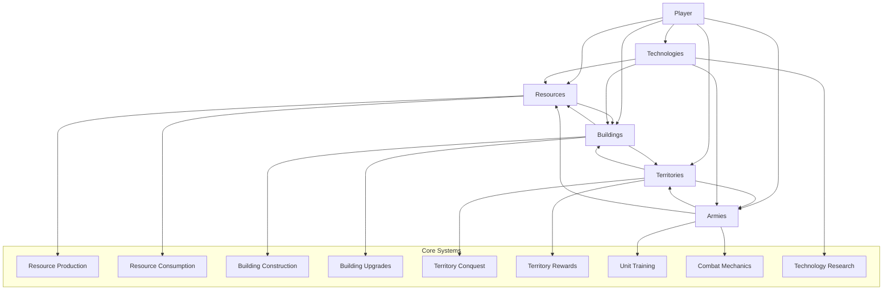

# Architecture Overview

## Component Diagram

## Component Descriptions

### 1. Player
- Central entity that owns and manages all game elements
- Contains player-specific data (name, prestige, achievements)

### 2. Resources
- Core game currency used for all actions
- Types: Timber, Stone, Iron, Food, Gold, Knowledge, Faith
- Produced by buildings, consumed by actions

### 3. Buildings
- Structures that produce resources, train units, or provide bonuses
- Can be upgraded to increase efficiency
- Have construction costs and dependencies

### 4. Territories
- External locations that can be conquered
- Provide rewards when conquered (buffs, items, new bases)
- Have different types with varying defense levels

### 5. Armies
- Military units used for conquest
- Different types (infantry, archers, cavalry, siege)
- Require training and equipment

### 6. Technologies
- Upgrades that improve various aspects of gameplay
- Unlocked through research using Knowledge resource

## Key Relationships

1. **Player-Resources**: Player manages resource collection and spending
2. **Player-Buildings**: Player constructs and upgrades buildings
3. **Player-Territories**: Player initiates conquest of territories
4. **Player-Armies**: Player trains and equips military units
5. **Player-Technologies**: Player researches technological advancements

6. **Resources-Buildings**: Buildings produce and consume resources
7. **Buildings-Territories**: Some buildings affect territory conquest
8. **Territories-Armies**: Armies are used to conquer territories
9. **Armies-Resources**: Training armies consumes resources
10. **Technologies-All**: Technologies can improve buildings, armies, and resource production

## Building Data Structures

### Farm
- **Purpose**: Food production
- **Base Cost**: 40 timber, 20 stone
- **Production**: 3 food/minute at Level 1
- **Upgrade Path**:
  - Level 2: 80 timber, 40 stone → 6 food/minute
  - Level 3: 160 timber, 80 stone → 12 food/minute

### Quarry
- **Purpose**: Stone production
- **Base Cost**: 50 timber, 30 food
- **Production**: 4 stone/minute at Level 1
- **Upgrade Path**:
  - Level 2: 100 timber, 60 food → 8 stone/minute
  - Level 3: 200 timber, 120 food → 16 stone/minute

### Iron Mine
- **Purpose**: Iron production
- **Base Cost**: 60 timber, 40 stone, 20 food
- **Dependency**: Requires Quarry Level 2
- **Production**: 2 iron/minute at Level 1
- **Upgrade Path**:
  - Level 2: 120 timber, 80 stone, 40 food → 4 iron/minute
  - Level 3: 240 timber, 160 stone, 80 food → 8 iron/minute

### Barracks
- **Purpose**: Unit training
- **Base Cost**: 70 timber, 50 food
- **Dependency**: Requires Farm Level 2
- **Production**: Enables unit training
- **Upgrade Path**:
  - Level 2: 140 timber, 100 food → Increases unit cap by 5
  - Level 3: 280 timber, 200 food → Increases unit cap by 10 (total +15)

### Warehouse
- **Purpose**: Resource storage expansion
- **Base Cost**: 80 timber, 60 stone, 40 food
- **Effect**: Increases resource caps by 100 each
- **Upgrade Path**:
  - Level 2: 160 timber, 120 stone, 80 food → Increases caps by additional 200
  - Level 3: 320 timber, 240 stone, 160 food → Increases caps by additional 400

## Dependency Gating System

Buildings with dependencies will only be available when prerequisites are met:
- Iron Mine: Requires Quarry Level 2
- Barracks: Requires Farm Level 2

## Unit Training System

### Peasant Spear
- **Cost**: 20 food, 10 timber (from game constants, but originally 10 food in architecture-plan)
- **Training Time**: 30 seconds
- **Stats**: Basic infantry unit

### Infantry Unit Cap System
- **Base Cap**: 5 units
- **Scaling**: +5 units per Barracks level
- **Implementation**: Enforce cap when training units

## UI Changes

### New Components
- Building cards for all new buildings
- Dependency indicators (lock icons/tooltips)
- Unit training interface
- Unit cap display
- Toast notification system

### Component Architecture
- `BuildingCard` component (reusable)
- `UnitTraining` component
- `ToastNotification` component
- `ResourceDisplay` enhancements

## Data Flow

1. **Resource Production**: Buildings → Resources
2. **Resource Consumption**: Resources → (Buildings, Armies, Technologies)
3. **Conquest Flow**: Player → Armies → Territories → Rewards → Player
4. **Upgrade Flow**: Player → Resources → Technologies → (Buildings, Armies, Resources)