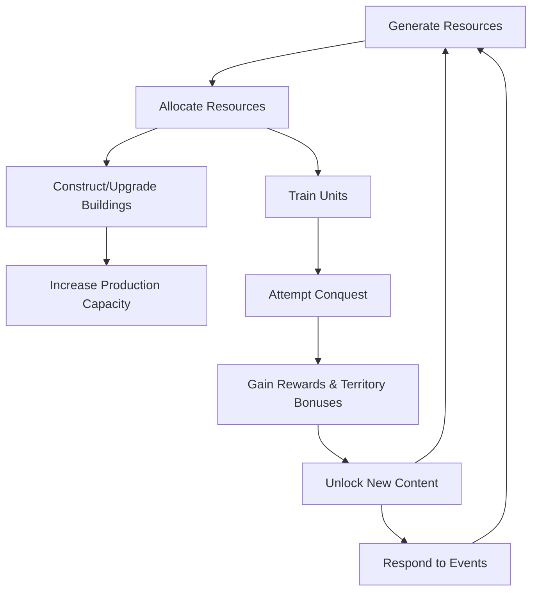

# Game Mechanics

## Overview

Lord of the Text is an incremental base-building game where you manage a kingdom as a lord, starting with your central manor and expanding your domain by constructing buildings, gathering resources, training armies, and conquering neighboring territories.

## Features

- **Base Building**: Manage your lord's manor and construct various buildings for resource production, military training, and infrastructure.
- **Resource Management**: Collect and allocate essential resources like timber, stone, iron, food, gold, knowledge, and faith.
- **Military Expansion**: Train diverse units including infantry, archers, cavalry, and siege engines to conquer territories.
- **Territory Conquest**: Raid villages, towns, castles, temples, and monster dens for passive buffs, unique items, and new manageable bases.
- **Technology Research**: Invest in knowledge to unlock technologies that enhance production, military strength, and strategic options.
- **Idle Mechanics**: Resources accumulate automatically with auto-save functionality allowing offline progress.
- **Random Events**: Respond to dynamic events that can boost production or pose challenges requiring strategic decisions.

## Core Gameplay Loop

### Step 1 – Resource Generation
- **Passive Production**: Resource buildings (e.g., Lumber Camp, Quarry, Farm) produce resources over time.
- **Player Interaction**: Collect accumulated resources and manage storage capacity.

### Step 2 – Resource Allocation
- Spend resources on:
  - Constructing new buildings
  - Upgrading existing buildings to increase production efficiency
  - Training units for the military
  - Researching technologies for passive bonuses

### Step 3 – Expansion & Conquest
- Use armies to attempt territory conquest.
- Conquest mechanics: Compare military strength vs territory defense.
- Success yields: New resources, production bonuses, unique units, increased territory influence.

### Step 4 – Unlocks & Progression
- Unlock new building types, unit types, and technologies.
- Progression provides faster production, access to higher-tier territories, expanded strategic options.

### Step 5 – Event & Challenge Response
- Periodic random events (positive or negative).
- Player makes strategic decisions.

### Step 6 – Save & Idle Progress
- Autosave to localStorage.
- Idle accumulation with storage caps.

### Core Loop Structure

The core gameplay loop defines the repeating cycle of actions the player engages in to progress in Lord of the Text. The loop balances resource generation, expansion, and progression, ensuring continuous engagement.

### Loop Diagram

Key elements:
1. Resources accumulate automatically
2. Players spend resources to build, train, and research
3. Military conquest provides rewards and new bases
4. Technology unlocks unlock new options
5. Random events add dynamism

Offline Progress:
- Resources continue to accumulate when the game is closed (capped by storage limits)
- Progress is saved automatically to localStorage