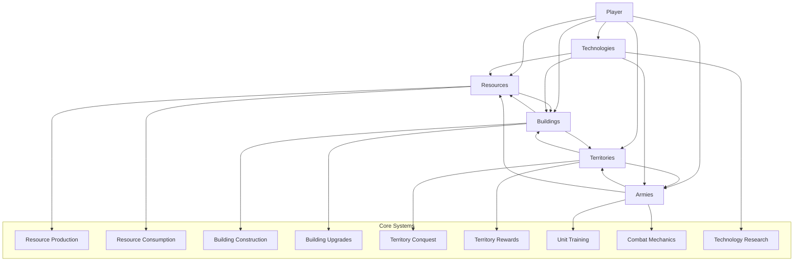

# Core Game Components and Relationships

## Component Diagram

## Component Descriptions

### 1. Player
- Central entity that owns and manages all game elements
- Contains player-specific data (name, prestige, achievements)

### 2. Resources
- Core game currency used for all actions
- Types: Timber, Stone, Iron, Food, Gold, Knowledge, Faith
- Produced by buildings, consumed by actions

### 3. Buildings
- Structures that produce resources, train units, or provide bonuses
- Can be upgraded to increase efficiency
- Have construction costs and dependencies

### 4. Territories
- External locations that can be conquered
- Provide rewards when conquered (buffs, items, new bases)
- Have different types with varying defense levels

### 5. Armies
- Military units used for conquest
- Different types (infantry, archers, cavalry, siege)
- Require training and equipment

### 6. Technologies
- Upgrades that improve various aspects of gameplay
- Unlocked through research using Knowledge resource

## Key Relationships

1. **Player-Resources**: Player manages resource collection and spending
2. **Player-Buildings**: Player constructs and upgrades buildings
3. **Player-Territories**: Player initiates conquest of territories
4. **Player-Armies**: Player trains and equips military units
5. **Player-Technologies**: Player researches technological advancements

6. **Resources-Buildings**: Buildings produce and consume resources
7. **Buildings-Territories**: Some buildings affect territory conquest
8. **Territories-Armies**: Armies are used to conquer territories
9. **Armies-Resources**: Training armies consumes resources
10. **Technologies-All**: Technologies can improve buildings, armies, and resource production

## Data Flow

1. **Resource Production**: Buildings → Resources
2. **Resource Consumption**: Resources → (Buildings, Armies, Technologies)
3. **Conquest Flow**: Player → Armies → Territories → Rewards → Player
4. **Upgrade Flow**: Player → Resources → Technologies → (Buildings, Armies, Resources)